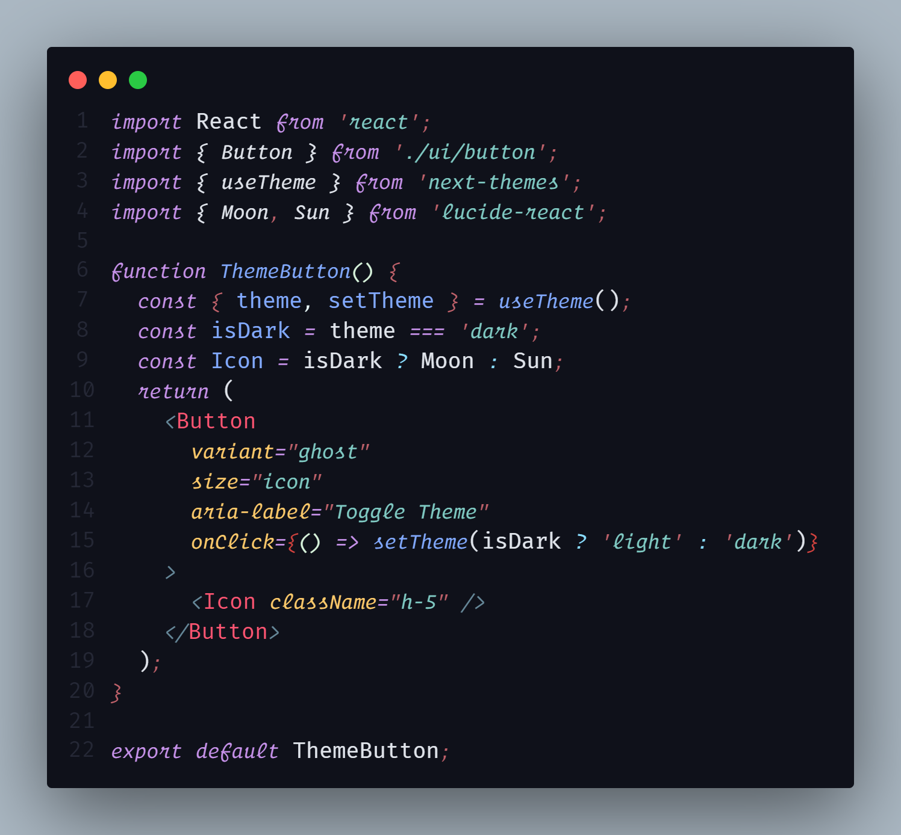

<h1 style="padding:0px; margin:0">Night Operator Theme</h1>

<h5 style="margin:auto;">A customized Dark Theme with Operator Mono support for Visual Studio Code.</h5>

 
 

# Installation
1. Open the Extensions sidebar in VS Code. <b>View → Extensions </b>
2. Search for and choose <b>Night Operator Theme</b> by <i><b>Sandesh Pandey</b></i>
3. Click Install to install it
4. Click Reload to reload your editor
5. Navigate to <b>File > Preferences > Color Theme > Night Operator Theme</b> or any of the variants listed
6. Yay! You're all set 🎉🎉.